## Hi there 👋

I speak code as a Staff Engineer. The stats below are generated nightly from my GitHub and npm activity.

<!-- METRICS:START -->
<a href="https://github.com/tamino-martinius"><picture><source media="(prefers-color-scheme: dark)" srcset="assets/github-user.dark.svg">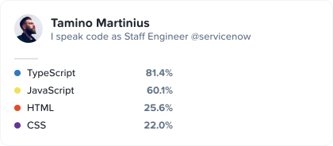</picture></a>

<picture><source media="(prefers-color-scheme: dark)" srcset="assets/github-total.dark.svg">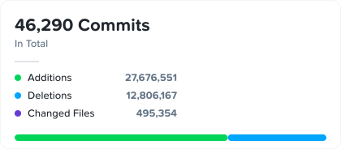</picture> <picture><source media="(prefers-color-scheme: dark)" srcset="assets/npm-total.dark.svg">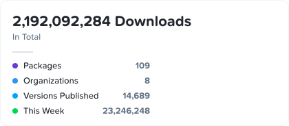</picture>

<picture><source media="(prefers-color-scheme: dark)" srcset="assets/github-daytime.dark.svg">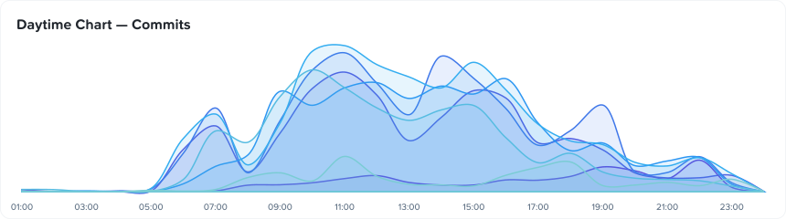</picture>

<picture><source media="(prefers-color-scheme: dark)" srcset="assets/npm-daytime.dark.svg">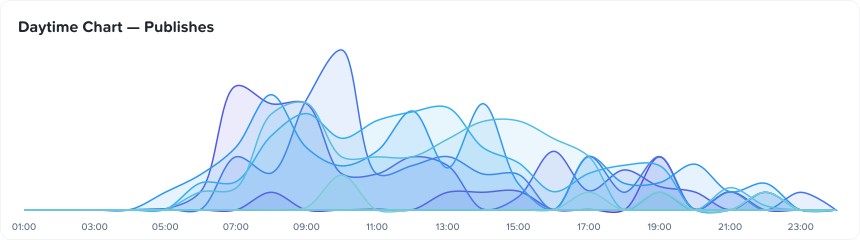</picture>

<picture><source media="(prefers-color-scheme: dark)" srcset="assets/repos/_header.dark.svg"></picture> <a href="https://github.com/tamino-martinius/ui-snippets"><picture><source media="(prefers-color-scheme: dark)" srcset="assets/repos/ui-snippets.dark.svg">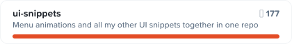</picture></a> <a href="https://github.com/tamino-martinius/node-ts-dedent"><picture><source media="(prefers-color-scheme: dark)" srcset="assets/repos/node-ts-dedent.dark.svg">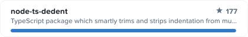</picture></a> <a href="https://github.com/tamino-martinius/metrics.tamino.dev"><picture><source media="(prefers-color-scheme: dark)" srcset="assets/repos/metrics.tamino.dev.dark.svg">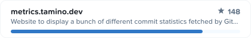</picture></a> <a href="https://github.com/tamino-martinius/meteor-smart-record"><picture><source media="(prefers-color-scheme: dark)" srcset="assets/repos/meteor-smart-record.dark.svg">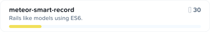</picture></a> <a href="https://github.com/tamino-martinius/tamino.dev"><picture><source media="(prefers-color-scheme: dark)" srcset="assets/repos/tamino.dev.dark.svg">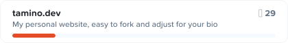</picture></a> <a href="https://github.com/tamino-martinius/lambda-get-all-github-contributions"><picture><source media="(prefers-color-scheme: dark)" srcset="assets/repos/lambda-get-all-github-contributions.dark.svg">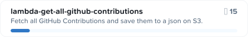</picture></a>

<picture><source media="(prefers-color-scheme: dark)" srcset="assets/packages/_header.dark.svg"></picture> <a href="https://www.npmjs.com/package/ts-dedent"><picture><source media="(prefers-color-scheme: dark)" srcset="assets/packages/ts-dedent.dark.svg">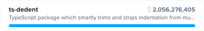</picture></a> <a href="https://www.npmjs.com/package/@central-icons-react/round-outlined-radius-3-stroke-2"><picture><source media="(prefers-color-scheme: dark)" srcset="assets/packages/central-icons-react-round-outlined-radius-3-stroke-2.dark.svg">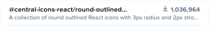</picture></a> <a href="https://www.npmjs.com/package/@central-icons-react/square-outlined-radius-0-stroke-1.5"><picture><source media="(prefers-color-scheme: dark)" srcset="assets/packages/central-icons-react-square-outlined-radius-0-stroke-1.5.dark.svg">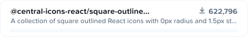</picture></a> <a href="https://www.npmjs.com/package/@central-icons-react/square-outlined-radius-0-stroke-2"><picture><source media="(prefers-color-scheme: dark)" srcset="assets/packages/central-icons-react-square-outlined-radius-0-stroke-2.dark.svg">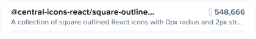</picture></a> <a href="https://www.npmjs.com/package/@central-icons-react/round-outlined-radius-1-stroke-1.5"><picture><source media="(prefers-color-scheme: dark)" srcset="assets/packages/central-icons-react-round-outlined-radius-1-stroke-1.5.dark.svg">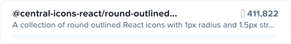</picture></a> <a href="https://www.npmjs.com/package/@central-icons-react/round-filled-radius-3-stroke-2"><picture><source media="(prefers-color-scheme: dark)" srcset="assets/packages/central-icons-react-round-filled-radius-3-stroke-2.dark.svg">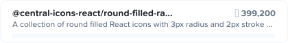</picture></a>
<!-- METRICS:END -->
